# 搭建Python开发环境


## 基于Windows系统搭建环境

- 下载安装包
- https://www.python.org/downloads/windows/

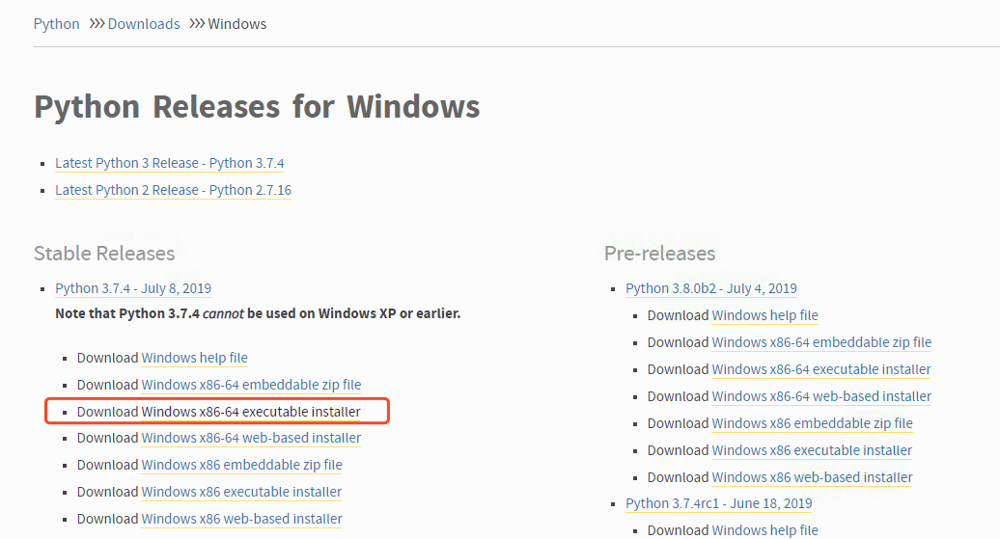

- 安装

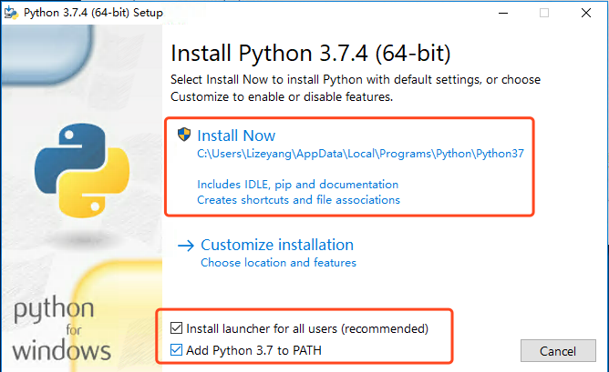

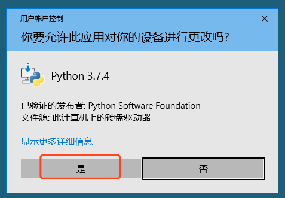


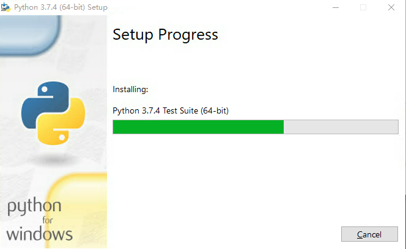

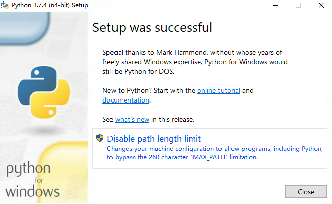

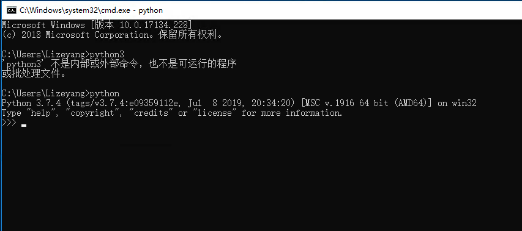


## 基于MacOS系统搭建环境
- 下载安装包windows
- https://www.python.org/downloads/mac-osx/
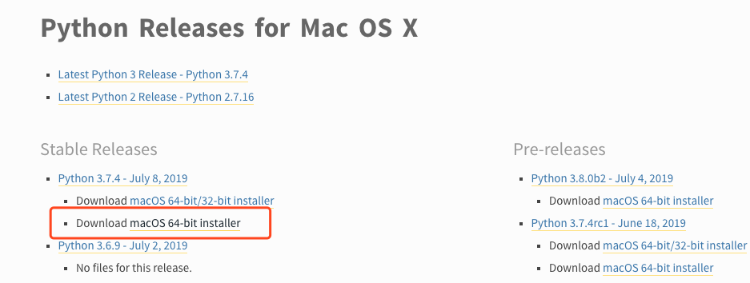

- 安装

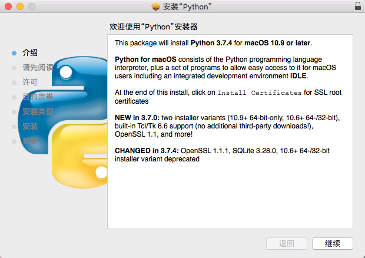

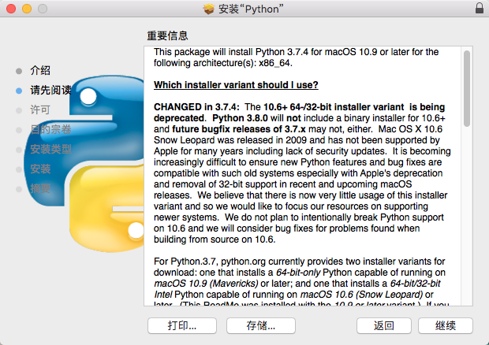

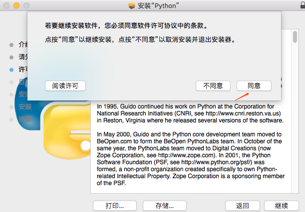

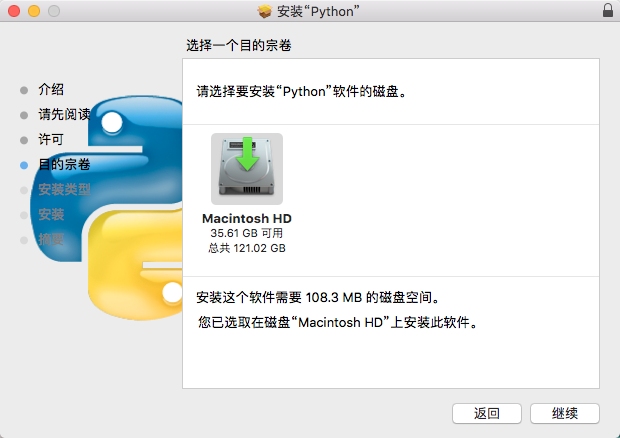

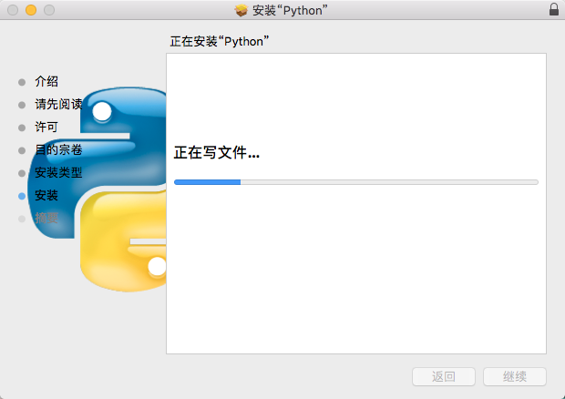

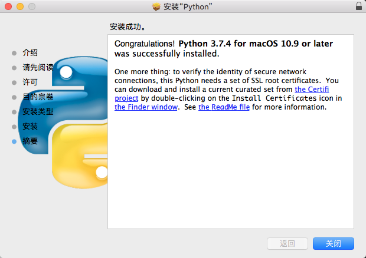
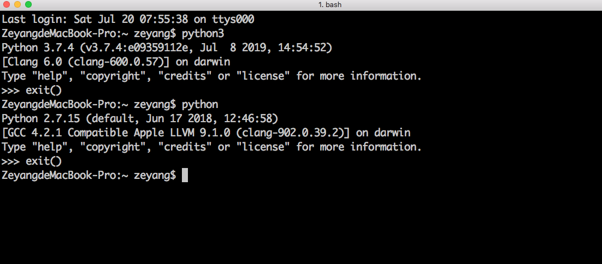
## 基于Linux系统搭建环境
- 下载 https://www.python.org/ftp/python/3.7.4/Python-3.7.4.tgz

```
[root@devops ~]# wget https://www.python.org/ftp/python/3.7.4/Python-3.7.4.tgz
--2019-07-20 08:41:48--  https://www.python.org/ftp/python/3.7.4/Python-3.7.4.tgz
Resolving www.python.org (www.python.org)... 151.101.108.223, 2a04:4e42:36::223
Connecting to www.python.org (www.python.org)|151.101.108.223|:443... connected.
HTTP request sent, awaiting response... 200 OK
Length: 23017663 (22M) [application/octet-stream]
Saving to: ‘Python-3.7.4.tgz’

 3% [==>                                                                                     ] 805,859     34.0KB/s  eta 13m 8s

yum -y install zlib-devel bzip2-devel openssl-devel ncurses-devel sqlite-devel readline-devel tk-devel gdbm-devel db4-devel libpcap-devel xz-devel libffi-devel
 
tar zxf Python-3.7.4.tgz -C /usr/local
cd /usr/local/Python-3.7.4
./configure --enable-shared --prefix=/usr/local/python37
make  && make install 

ln -s /usr/local/python37/bin/python3.7 /usr/local/bin/python3

cd /usr/local/python37/lib/
ls
libpython3.7m.so  libpython3.7m.so.1.0  libpython3.so  pkgconfig  python3.7
cp libpython3.7m.so.1.0  /usr/lib64/
```


- FAQ

```
Could not build the ssl module!
Python requires an OpenSSL 1.0.2 or 1.1 compatible libssl with X509_VERIFY_PARAM_set1_host().
LibreSSL 2.6.4 and earlier do not provide the necessary APIs, https://github.com/libressl-portable/portable/issues/381


 yum install openssl-devel  -y
 
 
[root@devops bin]# python3
python3: error while loading shared libraries: libpython3.7m.so.1.0: cannot open shared object file: No such file or directory
```


## 安装Python编辑器-VSCode
## 向世界问个好-Hello World！
- F5 执行

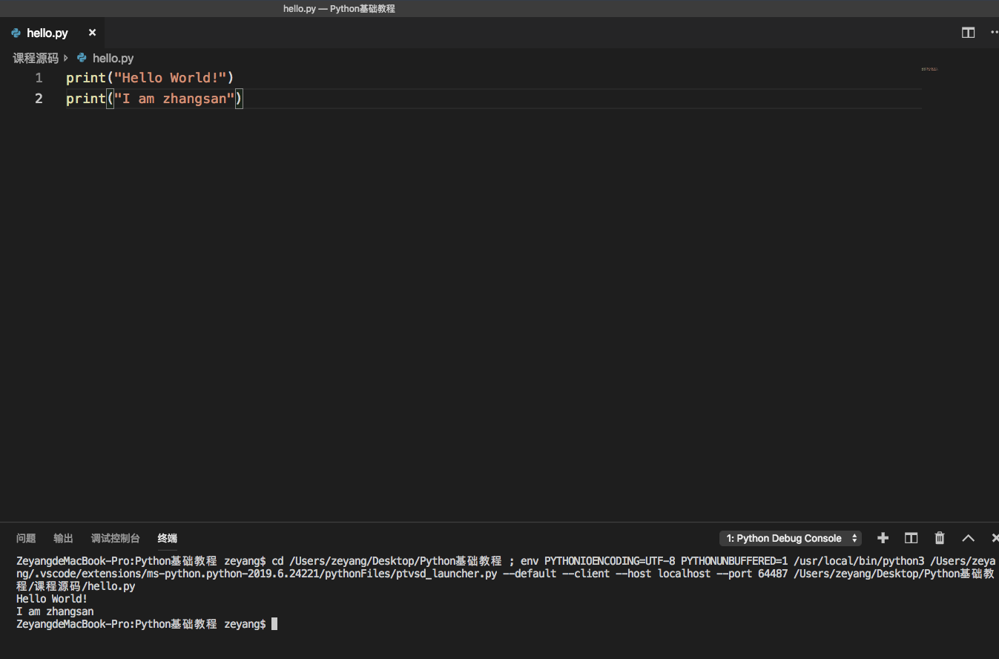
 
## Python变量定义与使用

### 变量命名
- 标识符第一个字符必须是字母(大写或小写)或者一个下划线 "_"
- 标识符名称的其他部分可以有字母(大写或小写)、下划线"_"或数字(0-9)组成
- 标识符名称是大小写敏感的Myname和myname不是同一个标识符
- 有效标识符： __my_name、name23、alb2_23
- 无效标识符：2things、this is spaced out、my-name
- 变量名尽量要求有意义、能够代表某些含义
- 变量名风格种类：task_detail、taskDetail、TaskDetail
- 关键字不能声明为变量名

['and', 'as', 'assert', 'break', 'class', 'continue', 'def', 'del', 'elif', 'else', 'except', 'exec', 'finally', 'for', 'from', 'global', 'if', 'import', 'in', 'is', 'lambda', 'not', 'or', 'pass', 'print', 'raise', 'return', 'try', 'while', 'with', 'yield']


## 实战-打印自己的信息

```python
print("Hello World!")
print("I am zhangsan")


name = "zhangsan"
sex = "男"
age = "40"
high = "178"
address = "Beijing"

print("myname is: " + name)
print("sex is : " + sex)
print("age is : " + age)
print("high is : " + high)
print("address is " + address)

----->>>

Hello World!
I am zhangsan
myname is: name
sex is : 男
age is : 40
high is : 178
address is Beijing
```